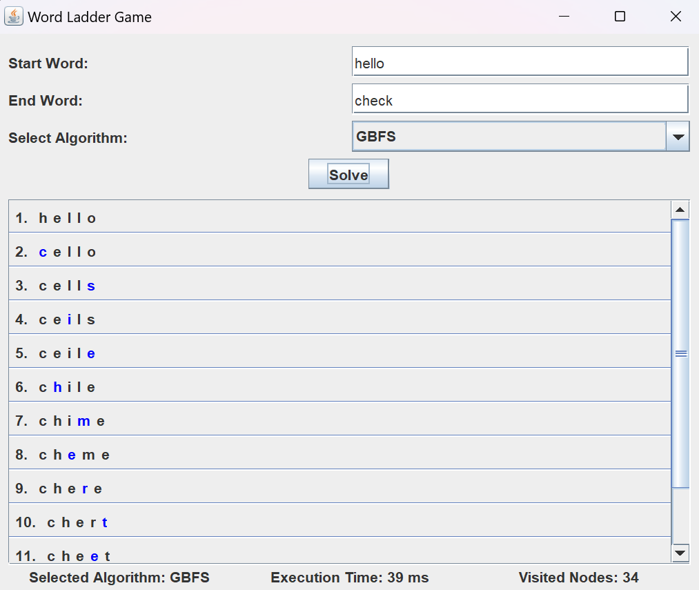
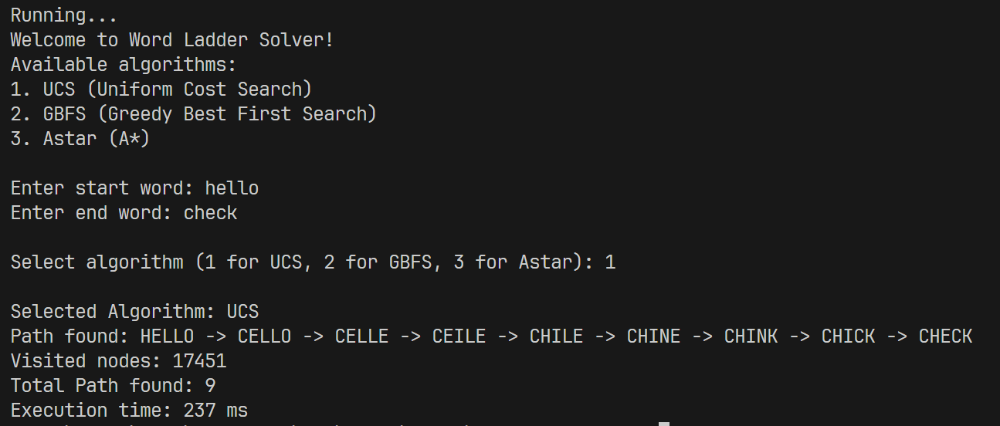

<h1 align="center">Tugas Kecil 3 IF2211 Strategi Algoritma</h1>
<h2 align="center">Semester II Tahun 2023/2024</h2>
<h3 align="center">Penyelesaian Permainan Word Ladder Menggunakan Algoritma UCS, Greedy Best First Search, dan A*</h3>


## Table of Contents
* [Overview](#Overview)
* [Technologies Used](#technologies-used)
* [Features](#features)
* [Setup](#setup)
* [How to Use the Program](#how-to-use-program)
* [Limitations](#limitations)
* [Creator](#creator)
* [Documentation](#documentation)
* [Links](#links)

## Overview
The Word Ladder game involves transforming a start word into a target word one letter at a time, with each intermediate step forming a valid word. This project implements three algorithms to solve the Word Ladder problem: Uniform Cost Search (UCS), Greedy Best First Search (GBFS), and A* (A-Star). The purpose is to explore these algorithms' effectiveness in finding the shortest transformation path between two words.

## Technologies Used
- **Java**: All backend logic and algorithms are implemented using Java, ensuring a robust and platform-independent solution.
- **Prerequisites**: 
  - **Windows**: Java 19 or newer must be installed on your machine to compile and run the code.
  - **Linux**: The latest version of Java must be installed on your machine to compile and run the code. Ensure that the java version installed is `non-headless` or you can download it using `sudo apt install openjdk-19-jdk` 

## Features
- **Algorithms**: Solves the Word Ladder game using three different algorithms:
  - **Uniform Cost Search (UCS)**:
    - Finds the lowest cost path to the goal by exploring nodes based on their costs.
    - Guarantees to find the optimal solution but can be computationally expensive.
    
  - **Greedy Best First Search (GBFS)**:
    - Selects nodes based on heuristic estimates of their proximity to the goal.
    - Efficient in memory usage but may not always find the optimal solution.
    
  - **A\* (A Star)**:
    - Combines UCS and GBFS by considering both actual cost and heuristic estimates.
    - Efficient and guarantees to find the optimal solution with a good heuristic.

- Each algorithm provides a unique approach to solving the problem, demonstrating the strengths and weaknesses of each method.

## Setup
To get started with the Word Ladder solver, you can clone the repository and run the application either via Command Line Interface (CLI) or Graphical User Interface (GUI).

1. Clone the repository
```bash
https://github.com/Filbert88/Tucil3_13522021.git
``` 
2. To run the GUI
- For Windows :
```
./run
```
- For Linux or MacOs :
```
chmod +x run.sh
./run.sh
```
3. To run via CLI
- For Windows :
```
./cli
```
- For Linux or MacOs :
```
chmod +x cli.sh
./cli.sh
```

## How to Use the Program
1. **Start and End Word**: Input the start word and the end word.
2. **Choose the Algorithm**: Select one of the three algorithms (UCS, GBFS, or A*) for solving the Word Ladder.
3. **Execution**: Upon running, the program will display the path from the start word to the end word, if one exists, along with the execution time and the number of nodes visited during the search.

## Limitations
- **Language Constraint**: This program currently supports only English valid words. Words from other languages or non-dictionary words are not **accepted**.
  
- **Word Length Requirement**: Both the start and end words must have the same length. This restriction ensures that the word ladder puzzle remains solvable within the constraints of the implemented algorithms.

## Creator
| NIM      | Nama    | Kelas |
| -------- | ------- | ----- |
| 13522021 | Filbert | K-01  |

## Documentation
### Graphical User Interface (GUI)


### Command Line Interface (CLI)


## Links

- Repository : https://github.com/Filbert88/Tucil3_13522021.git
- Issue tracker :
  - If you encounter any issues with the program, come across any disruptive bugs, or have any suggestions for improvement, please don't hesitate to reach out by sending an email to filbertfilbert21@gmail.com. Your feedback is greatly appreciated.